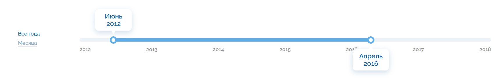
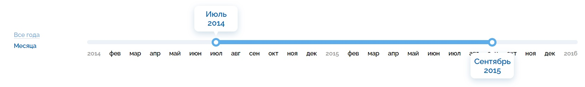

# Слайдер диапазона дат

## Стили
Для корректного отображения элементов необходимо подключтиь стили. Скачайте и подключите файл "style.css" на своюй страницу в блоке `<head></head>`. Помимо стилей компонет использует нестандартный стиль шрифта, для этого подключите в блок `<head></head>` скопирова код ниже:

```
<link href="https://fonts.googleapis.com/css2?family=Raleway:wght@600&display=swap" rel="stylesheet">
```

## Структура
Для начала работы с данным компонентом необходимо вставить следующий блок кода на свою страницу.
```
<div class="slider">
      <div class="switcher">
        <input type="radio" name="switch" id='all-year' checked>
        <label for="all-year"><span>Все года</span></label>
        <input type="radio" name="switch" id='all-month' class="switch">
        <label for="all-month"><span>Месяца</span></label>
      </div>
      <div class="slider-block">
        <div class="slider-block__bar">
          <div class="tooltip tooltip-min">
            <div class="tooltip-min__block tooltip-block">
            </div>
            <div class="tooltip-min__triangle"></div>
          </div>
          <div class="tooltip tooltip-max">
            <div class="tooltip-max__block tooltip-block">
            </div>
            <div class="tooltip-max__triangle"></div>
          </div>
          <div class="min"></div>
          <div class="range-color"></div>
          <div class="max"></div>
        </div>
        <div class="slider-block__text">
        </div>
      </div>
    </div>
```

## Логика
Логика программы реализована в файле "slider.js". Для начала работы скачайте и подключите файл в конце документа перед закрытием тега `<body>`, выглядит это примерно так:

```
<body>
  ...
  <script src="./slider.js"></script>
  <script src="./main.js"></script>
</body>
```

Помимо этого выше показно подключение файла "main.js" - это "точка входа". В данном файле мы вызываем функцию `slider()`, которая отрисовывает сам слайдер.
Функция `sldier(startDate, endDate, startPoint, endPoint)` принимает на вход 4 параметра.

**startDate** - левая граница диапазона (начальная дата)
**endDate** - права граница диапазона (конечная дата)
**startPoint** - положение левого ползунка, формат записи - строка вида "01.2015" или "01/2015". (01 - месяц [_отсчет идет с 00(январь)_], 2015 - год)
**endPoint** - положение правого ползунка, формат записи - строка вида "04.2017" или "04/2017". (04 - месяц [_отсчет идет с 00(январь)_], 2017 - год)

**startDate** должен быть левее **endDate**, т.е. меньше в цифровом эквиваленте.

<span style="color:green">Верно</span>
>startDate = 2012, endDate = 2020

<span style="color:red">Неверно</span>
>startDate = 2018, endDate = 2015

**startPoint** должен располагаться левее **endPoint**, т.е. во временном эквиваленте раньше.

<span style="color:green">Верно</span>
>startPoint = '05.2012', endPoint = '04.2020'

<span style="color:red">Неверно</span>
>startPoint = '05.2018', endPoint = '04.2012'

Также недопускается передавать в качестве атрибутов **startPoint** и **endPoint** число.

Допускается:
>'05/2012', '05.2012', "05/2012", "05.2012"

Не допускается:
>05/2012, 05.2012

Пример вызова функции для отрисовки компонента и подключение логики:

>`slider(2012, 2018, '05.2012', '03.2016')`

В итоге получится следующий блок:



### Переключатели (Все года/Месяца)

В компоненте для более детального просмотра диапазона можно переключаться с отрисовки только годов на отрисовку месяцев между гадами, для этого необходимо нажать на "Месяца" и слайдер приобретет следующий вид:

